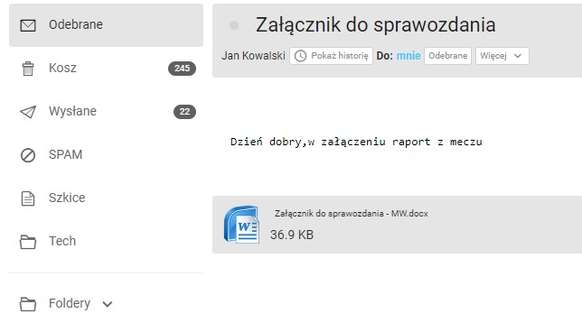

## About the project

Pomorski ZPN is mobile app for referees that allows to fill protocol about stadium facilities, create word document and sent by email to specific department in football association.


### Built with

App has been built using:

* [KivyMD](https://kivymd.readthedocs.io/en/1.1.1/)
* [SQLite](https://www.sqlite.org/index.html)
* [Python-docx](https://python-docx.readthedocs.io/en/latest/)
* [Python-dotenv](https://pypi.org/project/python-dotenv/)
* API email delivery service

## How it works?

At first user needs to enter settings and set email addresses and name. App won't let user to fill to form without adjusting preferences in settings section


When settings are configure user can select league, input teams, date and using checkboxes select which facitilies are available on the stadium.


If all fields are selected and connection with internet is establish app will create word document which is send by email to address provided in settings.

 


## Installation

1) Using pipenv install required packages from pipfile
2) For Windows machine package pypiwin32 is required
3) Create .env file with details

```
API_KEY=YOUR API KEY
API_DOMAIN=YOU API DOMAIN
```
App uses mailgun email service so domain and key needs to be get from this service

4) Run main.py file to start app
